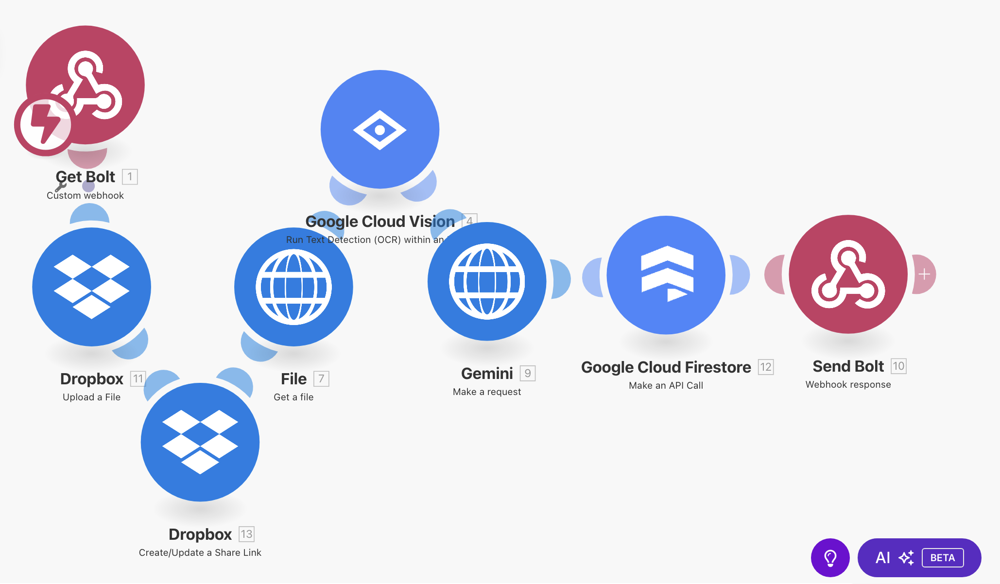
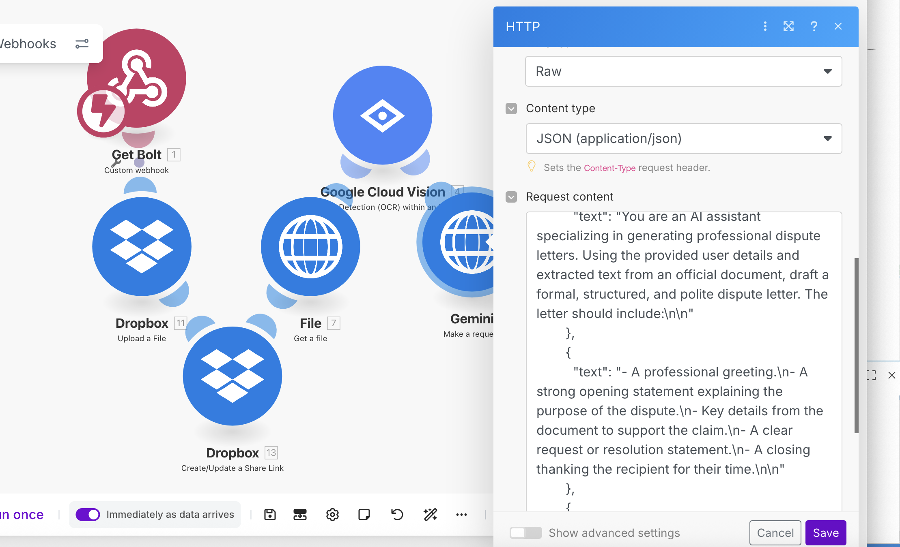

# 🚗 Parking Ticket Automation System

This project automates the handling of parking/traffic tickets for rental companies using a fully serverless AWS-based pipeline. It integrates OCR, AI, and email notifications to eliminate manual ticket processing.


---

## 🔧 Key Technologies

- **Frontend**: HTML/CSS/JS dashboard (hosted on S3)
- **AWS Services**:
  - S3 (image storage)
  - Lambda (4 functions)
  - API Gateway (HTTP API for `/upload` and `/tickets`)
  - DynamoDB (`Tickets` and `Drivers` tables)
  - SES (driver/admin notifications)
- **External APIs**:
  - Google Cloud Vision (OCR)
  - Gemini 1.5 Flash (AI parsing)
- **IaC**: Terraform (provision Lambda + API Gateway)

---

## ⚙️ Project Workflow

1. **Admin uploads a ticket image** via `dashboard.html`.
2. The image is sent to API Gateway and stored in S3.
3. S3 triggers a Lambda (`OcrToAWS`) that calls Google Vision OCR.
4. OCR text is passed to `ProcessTicketOCR`, which:
   - Uses Gemini to extract fields
   - Stores the result in DynamoDB
   - Looks up the driver by licence plate
   - Sends an email with a proof of payment link or fallback to admin
5. Admins can view all `PENDING` tickets on the dashboard (via `/tickets` endpoint).

---

## 🗂️ Folder Structure

```
lambda_google_ocr/
├── lambdas/
│   ├── upload_to_s3/
│   ├── ocr_to_aws/
│   ├── process_ticket/
│   └── list_tickets/
├── terraform/
│   ├── main.tf
│   └── lambda zip files
├── frontend/
│   ├── dashboard.html
│   └── index.html
├── test_assets/
│   └── test_ticket.jpg
├── project_diagram.png
├── .gitignore
└── README.md
```

---

## 📦 Deployment Steps

1. `terraform init && terraform apply` to deploy `ListTickets` + API
2. Zip and upload each Lambda manually or via CI
3. Deploy frontend to S3 (static site)
4. Set proper CORS in API Gateway (`POST` and `GET` support)
5. Set environment variables for:
   - `EMAIL_FROM_ADDRESS`
   - `PAYMENT_FORM_URL`
   - `GEMINI_API_KEY`

---

## ✨ Highlighted Skills

✅ Serverless architecture  
✅ Multi-cloud integration (AWS + Google)  
✅ Real-time OCR and AI parsing  
✅ Automated email workflows  
✅ Dashboard UI with secure fetch  
✅ Terraform IaC  
✅ Full-stack pipeline with monitoring

---

## 🧠 Future Improvements

- Mark tickets as paid from dashboard
- Admin authentication (Cognito)
- Search/filter ticket list
- Upload PDF/ticket multipage support

---

## 📦 Automation 




Workflow Steps:

File Upload: Tickets/documents are uploaded to Dropbox for centralized storage and accessibility
OCR Processing: Google Cloud Vision API extracts text content from uploaded ticket images using optical character recognition
AI Analysis: Gemini processes the extracted text to identify key information, categorize tickets, or extract structured data
Database Storage: Processed ticket data is saved to Google Cloud Firestore for persistent storage and querying
Webhook Integration: Get Bolt and Send Bolt webhooks handle workflow triggers and completion notifications

Key Benefits:

- Eliminates manual data entry from physical/scanned tickets
- Leverages AI to intelligently parse and categorize ticket content
- Provides scalable cloud storage for both files and structured data
- Enables automated notifications and downstream processing via webhooks

Tech Stack:

- Storage: Dropbox (files), Google Cloud Firestore (structured data)
- Processing: Google Cloud Vision (OCR), Gemini (AI analysis)
- Integration: Custom webhooks for workflow orchestration

## AWS Lambda vs Make.com Automation Tradeoffs

### AWS Lambda Pros

- Full control - Write exactly the logic you need without platform constraints
- Cheaper at scale - No monthly fees, just pay for what you use
- Proper development workflow - Version control, testing, and proper deployment practices

### AWS Lambda Cons 
- Time investment - Setting up infrastructure, debugging and deployment takes weeks
- Complexity - Managing multiple services, CORS, IAM policies and error handling
- Development overhead - Need to write code for basic integrations that Make.com handles automatically

### Make.com Pros

- Speed - Build and deploy workflows in hours, not weeks
- No coding needed - Visual interface means anyone can maintain and modify flows
- Built-in integrations - Dropbox, Gemini, databases all work out of the box

### Make.com Cons

- Monthly costs - Subscription fees add up, especially with higher usage
- Platform limitations - Sometimes you can't implement exactly what you want
- Less flexibility - Stuck with their connectors and processing logic

### Conclusion 

Make.com was honestly pretty fun to use for getting the initial workflow up and running - you can see results immediately and it feels satisfying to drag and drop your way to a working system. But when you're thinking about actually putting this into production, Lambda just makes more sense.

Everything stays within the AWS family, so you don't have weird integration issues or have to learn several third-party service integrations. When something breaks, you can actually figure out what's wrong thanks to all the documentation and Stack Overflow answers out there. 

The initial setup is more work, but you end up with something that's actually yours and can grow with your needs.

